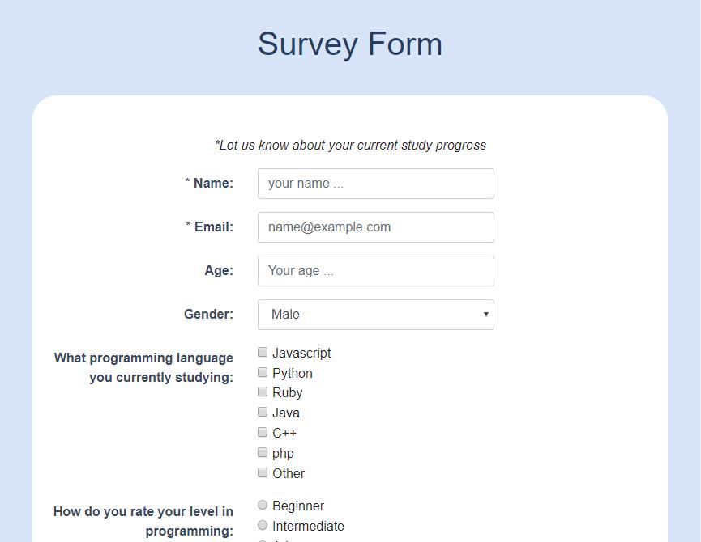

# FreeCampCode Project - Build a Survey Form

### Survey Form requirements 
#### A form that includes:
- Input for name
- Input for email
- Input for number
- Dropdown
- Checkboxes
- Textarea
- Submit button
- Validation for name email and number
#### More detail about this project requirements
https://learn.freecodecamp.org/responsive-web-design/responsive-web-design-projects/build-a-survey-form
#### Screenshot

